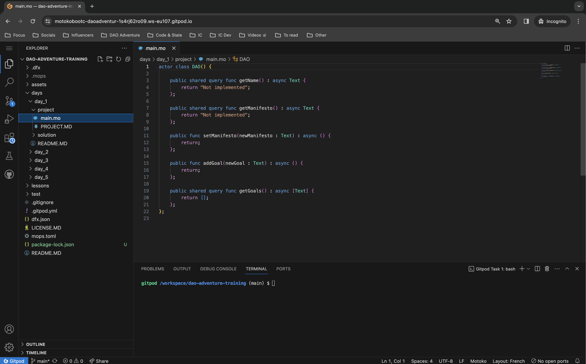
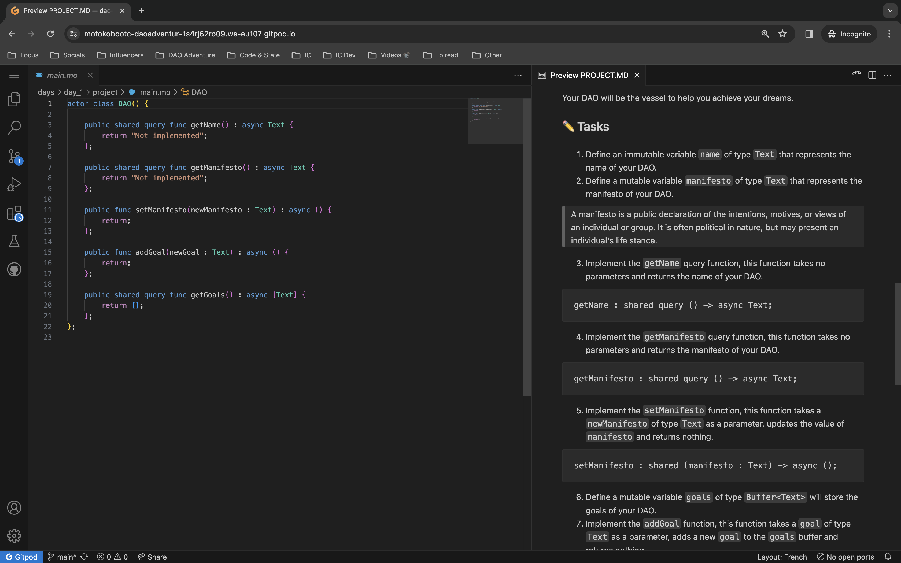
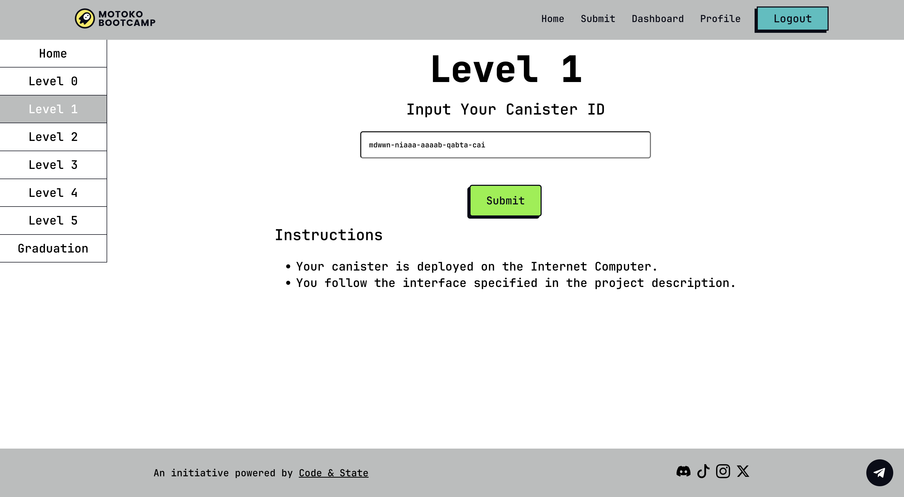

# Motoko Bootcamp - DAO Adventure - Training


> This repository is a training for the DAO Adventure. To check out the complete DAO Adventure repository, [click here](https://github.com/motoko-bootcamp/dao-adventure).

## Important resources 📌

- **Motoko Bootcamp Dashboard**: [https://www.motokobootcamp.com/](https://www.motokobootcamp.com/) (Click on **Login** to access)
- **Repository**: [https://github.com/motoko-bootcamp/dao-adventure-training](https://github.com/motoko-bootcamp/dao-adventure-training)
- **Motoko Bootcamp Discord**: [https://discord.gg/qEF2W3dBrd](https://discord.gg/qEF2W3dBrd)
- **Notion guide**: [https://tomahawkvc.notion.site/Motoko-Bootcamp-Training-8d458e52c20644f5a5b2e222705bfc64?pvs=4](https://tomahawkvc.notion.site/Motoko-Bootcamp-Training-8d458e52c20644f5a5b2e222705bfc64?pvs=4)

## Motivation 💭

**DAOs** are a new form of organization. **The Internet Computer** is a new platform. **Motoko** is a new language. Yes, that’s a lot of new concepts. Learning new concepts takes time. Actually, even more than time, it requires training - intense and focused training. This is what the **training phase** is about: you will discover and build 5 projects in 5 days.

Those projects are small but essential components of what makes up a DAO. Each project has a set of associated resources (videos, articles, tutorials…) that will help you achieve your goals. Each project and associated resources are designed to be completed within a span of about one day.

## **How to get started?** 🚀

You have two available options:

1. Run this repository directly in your browser. This is the easiest way to get started. You can do so by clicking on the following button:

> **GitPod is a cloud-based development environment. We will use it to access and edit the project files directly from the web browser. That way you don’t have to install any additional software or worry about setting up your development environment locally.**

> If you are facing issues with GitPod: 1. Try switching to another browser (Chrome is recommended) 2. Try to empty your cache and do a hard reset. 3. Try using Incognito Mode.

> [](https://gitpod.io/#https://github.com/motoko-bootcamp/dao-adventure-training)

2. Run this repository locally. You'll need to install the [DFINITY Canister SDK](https://sdk.dfinity.org/docs/quickstart/local-quickstart.html) to do so and setup your environment. You can find a detailed guide on how to do so [here](https://www.youtube.com/watch?v=DTDP7WYU07w). Then simply download this repository and open it in your favorite IDE.

Once the repository has been successfully opened (using your browser or locally) you are ready to start your training.

## How to use this repository? 🤔

### Daily guides 📜

For each of the 5 days of the training, you will find a dedicated daily guide. This guide contains:

1. **Tasks for the Day (✅)**: These are the tasks you'll need to tick off to wrap up the day.
2. **Lectures to Watch (🍿)**: A mix of videos for you to watch. Some are pre-recorded, and for others, you'll need to check the Motoko Bootcamp Calendar for live sessions.
3. **Helpful Resources (📚)**: Here, you'll find links and resources to help you with the day's project.
4. **Concepts Covered (🧠)**: A list of all the concepts we'll go over each day. It's good to skim through this at the start and end of your day to keep track.
5. **Motoko Fact of the Day (💊)**: A quick, interesting, and fun fact about Motoko, Motoko Bootcamp, or the ICP ecosystem.
6. **Meme of the Day (🙈)**: Enjoy some fun memes made by past Motoko Bootcamp grads.

---

Here are the 5 daily guides:

- [Day 1.](https://github.com/motoko-bootcamp/dao-adventure-training/tree/main/days/day_1)
- [Day 2.](https://github.com/motoko-bootcamp/dao-adventure-training/tree/main/days/day_2)
- [Day 3.](https://github.com/motoko-bootcamp/dao-adventure-training/tree/main/days/day_3)
- [Day 4.](https://github.com/motoko-bootcamp/dao-adventure-training/tree/main/days/day_4)
- [Day 5.](https://github.com/motoko-bootcamp/dao-adventure-training/tree/main/days/day_5)

### Daily projects ⭐️

During each of the 5 days of training, you'll get to work on a project. You'll need to build it and then submit it on the Motoko Bootcamp dashboard. Each project is set up in a similar way:

- **Story (💭) - a quick background story about why this project matters.**
- **Mission (🎯) - a high level explanation of what you’ll need to build today.**
- **Tasks (✏️) - a list of tasks to help you achieve your mission.**
- **Interface (📺) - This is the specific interface your canister should match. Stick to it closely to get your project approved. Remember, even tiny details (like whether a letter is uppercase or not in a function’s name) can make a difference.**

---

Here is an overview of the 5 projects:

- **[Project 1 - What is your dream?](https://github.com/motoko-bootcamp/dao-adventure-training/blob/main/days/day_1/project/PROJECT.MD)**
- **[Project 2 - Building bonds](https://github.com/motoko-bootcamp/dao-adventure-training/blob/main/days/day_2/project/PROJECT.MD)**
- **[Project 3 - Supercharging your DAO with economic power](https://github.com/motoko-bootcamp/dao-adventure-training/blob/main/days/day_3/project/PROJECT.MD)**
- **[Project 4 - The collective voice](https://github.com/motoko-bootcamp/dao-adventure-training/blob/main/days/day_4/project/PROJECT.MD)**
- **[Project 5 - Showing the DAO to the world](https://github.com/motoko-bootcamp/dao-adventure-training/blob/main/days/day_5/project/PROJECT.MD)**

### Start to code 🧑‍💻

For each training day, navigate to the designated folder. For example, on day 1, follow this path:

**`days → day_1 → project → [main.mo](http://main.mo)`**

Here, you'll find a piece of code that's already been started for you. Your task is to complete it.



It's a good idea to keep the list of tasks visible on the right side of your screen while you work, as shown in the screenshot below. This way, you can easily refer to them as you progress.



### Deploy and submit ✅

It’s important to understand that you can deploy your project on 3 different locations:

- **Locally (on your own computer - free)**
  This would be the case if you start a local replica (i.e., a local instance of the Internet Computer running on your machine). This is completely free and used by developers to test their projects. To deploy locally:

  1. **Start a local replica**
     ```jsx
     dfx start --clean
     ```
  2. **Deploy locally**
     ```jsx
     dfx deploy <NAME_OF_THE_CANISTER_TO_DEPLOY>
     ```
  3. **For instance, for the canister of project 1**
     ```jsx
     dfx deploy project_1
     ```
     **⚠️ While deploying projects locally is useful for testing, you won't be able to submit these projects to the Motoko Bootcamp Dashboard. This limitation exists because the dashboard operates on the Internet Computer's main network (mainnet) and is not designed to connect with or recognize projects running on your local replica.**

- **On the Playground (free)**
  The Playground is a special part of the Internet Computer mainnet. It’s a place where developers can develop canisters for free and make them accessible to other canisters on the Internet Computer but it comes with strict limitations:

  - Cycle transfer instructions are silently ignored by the playground (otherwise you’d be able to steal cycles…)
  - Wasm files can't be gzipped.
  - Wasm files will be analyzed to remove any potentially expensive/malicious operations.
  - Canisters can use at most 1GB of memory.
  - Canisters can call the management canister to manage itself without being the controller.
  - Deployed canisters expire after 20 minutes
    The playground is used by the [Motoko Playground](https://m7sm4-2iaaa-aaaab-qabra-cai.raw.ic0.app/) when deploying canisters, but we can also use it with `dfx`. To deploy on the playgound:
    ```jsx
    dfx deploy --playground <NAME_OF_THE_CANISTER_TO_DEPLOY>
    ```
    **💡 Projects that are deployed on the playground can be submitted to the Motoko Bootcamp Dashboard. This is because the playground, despite being a separate section, is still integrated with the Internet Computer. For the entire training period we recommend that you use the playground.**

- **On the Internet Computer (paid)**
  When you deploy an application on the Internet Computer for actual use, it involves some costs. First, there's a fee for setting up a canister, which is roughly $1. Additionally, you need to consider the expense of the cycles required to power your canister. These costs are necessary for deploying a live, functioning application on the Internet Computer.
  1. Setup your identity and get your hands on cycles. You can either pay for it by burning ICPs or receive 10$ worth of cycles if it’s your first time. [Follow this tutorial to receive 10$ worth of cycles.](https://internetcomputer.org/docs/current/developer-docs/setup/cycles/cycles-faucet)
  2. Deploy on the Internet Computer using `dfx`
     ```jsx
     dfx deploy --network ic <NAME_OF_THE_CANISTER_TO_DEPLOY>
     ```
     ⚠️ **If you're working with an online IDE like GitPod, we strongly recommend not deploying directly on the Internet Computer. The reason is that your unique identity gets stored in your online workspace. If you delete this workspace or lose access to it for any reason, you will also lose your identity. Losing your identity means losing control over your canister. To deploy on the Internet Computer, it's safer to set up your environment on your local machine. This will be a necessary requirement for graduation but as stated before, it’s not a requirement for the training, you can use the playground.**

After deploying your project, make sure to record your Canister ID.


Then, log in to the Motoko Bootcamp Dashboard, section **Submit,** Level corresponding to the project you are working on and paste the **Canister ID**. Click on **Submit**. Within 10-20 seconds, you should receive a message confirming the submission or indicating an error.



If your submission is correct, you can move on to the next project. If you are facing an issue, it’s time to rework your code!

## **Joining a team at Motoko Bootcamp (recommended)** 🤝

[COMING SOON]

## **What’s next?** 🎓

You’ve completed your training? It’s time to prove your skills and graduate. [Click here to continue.](https://github.com/motoko-bootcamp/dao-adventure-graduation)

## **Credits** 🙏

An initiative powered and 100% supported by [Code & State](https://www.codeandstate.com/) - the leading Web3 venture studio for the Internet Computer.
