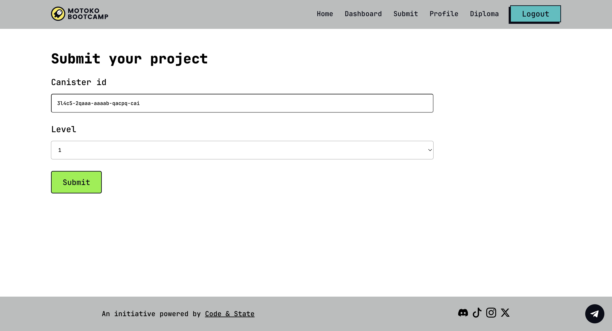

# Motoko Bootcamp - Join the Web3 revolution!

<p>  </p>

## Your mission 📜

If you want to become one of Web3 hero, you are in the right place. <br/>

<p align="center">  </p>

DAOs are the future of work and human organizations. They are the building blocks of the Web3 revolution. <br/>

Your task is simple, yet challenging. You have 7 days to build an application that leverages the power of DAO on the Internet Computer. <br/>

Are you up for the challenge? If so, the detailed requirements of the challenge are available in the corresponding [project](./levels/level_6/project/PROJECT.MD) folder.

## How to navigate this repository? 🧭

This repository contains a variety of resources, each serving a specific purpose. Here is a comprehensive list of the resources available, along with a brief explanation of each:

### Lessons 📚

This repository contains 13 chapters and 2 appendix. Those lessons will teach the fundamentals of **Motoko**, the **Internet Computer** and **DAOs**. Each lesson contains a README file with the material.

For instance, you can check the [the 1st lesson](./lessons/chapter-1/CHAPTER-1.MD).

### Levels 🏆

This repository is divided into 7 levels, from 0 to 6. <br/>
Each level has a project and a guide that brings you closer to building a DAO. You’ll find clear instructions in the README file for each level. The project is the main deliverable for each level. You’ll need to complete the project to move on to the next level.

The projects from level 0 to 5 are only training projects and will be corrected by the mentors. The project from level 6 is the final project and what you'll be submitting to get your diploma.

### Guide 📖

For each level you'll find a dedicated guide that contains:

- A list of lectures for this day and their description. A lectures is a live session with a mentor where you'll learn about a specific topic.
- A list of resources (tutorials, documentation or article) for this day. Those resources are here to help you complete the project for this level.
- A list of concepts that you should master by the end of the day. Those concepts are here to help you assess your understanding of the material.
- A list of tasks that you need to complete to finish the level.
- A Motoko pill. This is a fun fact about Motoko that you can share with your friends.
- A meme. Those are memes created by previous Motoko Bootcamp student.

For instead, here is the guide for [the 1st level](./levels/level_1/README.MD).

#### Project 📝

For each level you'll find a dedicated project that contains:

- A story about why you are building this project.
- A list of tasks and function to implement to complete the project.
- An interface that corresponds to the API of your canister at the end of the level.
- A set of tests that you can run locally to check if your code is correct. You can run those tests by running the following command in your terminal:

```bash
mops test level-n
```

> Those tests are local and won't replace the mandatory submission of your project at the end of each level on the [Motoko Bootcamp Dashboard](https://www.motokobootcamp.com/).

For instance you can check [the project for the 1st level](./levels/level_1/project/PROJECT.MD).

## How to graduate? 🎓

To graduate from Motoko Bootcamp, you need to submit all the levels of the bootcamp. Each level is a set of tasks that you need to complete. To complete a task, you need to implement the missing code in the `src/main.mo` file. Once you're done, you can run the tests to check if your code is correct. To run the tests, you can run the following command in your terminal:

```bash
mops test level-n
```

With n being the number of the level you want to test.

Once you've succesfuly passed the local test, it's time to put your canister to the real test, on the Internet Computer. To do so, you need to deploy your canister on the Internet Computer and verify it using the online dashboard on [Motoko Bootcamp](https://www.motokobootcamp.com/).

Head over to the **submit** section and submit the id of the canister you've deployed on the Internet Computer. If your canister passes the tests, you'll be able to move on to the next level.

<p>  </p>

Once you've completed all the levels, you'll be able to claim your Diploma in the **Diploma** section.

## How to get started with this repository? 🚀

You have two options to get started with this repository:

1. Run this repository directly in your browser. This is the easiest way to get started. You can do so by clicking on the following button:
2. Run this repository locally. You'll need to install the [DFINITY Canister SDK](https://sdk.dfinity.org/docs/quickstart/local-quickstart.html) to do so and setup your environment. You can find a detailed guide on how to do so [here](https://www.youtube.com/watch?v=DTDP7WYU07w).

## Useful links 🔗

- [Website](https://www.motokobootcamp.com/)
- [Discord](https://discord.gg/uAvPEZtD4e)
- [Twitter](https://twitter.com/motoko_bootcamp/)
- [YouTube](https://www.youtube.com/@motoko_bootcamp)
- [Instagram](https://www.instagram.com/motokobootcamp/)
- [TikTok](https://www.tiktok.com/@motoko_bootcamp)
- [Telegram](https://t.me/+pwW_RfcXsscyMTQ0)
- [OpenChat](https://oc.app/community/kvmak-aaaaa-aaaar-atmsq-cai/channel/296950142123807371690206543790609462636/?ref=lfwpr-yyaaa-aaaaf-abvzq-cai)

## Join us for the next edition 🏕️

We host monthly editions of Motoko Bootcamp.

This is a place to brainstorm, collaborate and build the future of DAOs, and other projects on the Internet Computer. Join us for the next edition of Motoko Bootcamp by registering through our [website](https://www.motokobootcamp.com/).

## Credits 🙏

An initiative powered and 100% supported by [Code & State](https://codeandstate.com/) - the leading Web3 venture studio for the Internet Computer.
