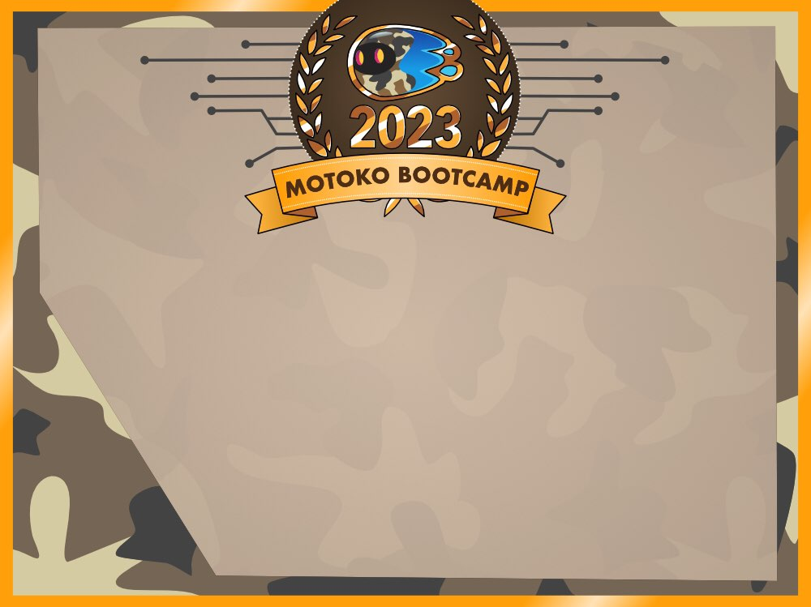

# The DAO Adventure - Starter

<div style="text-align: center;">
  
</div>


> This repository contains the starter code for the DAO Adventure project. You are required to complete the code across all 7 chapters.

## Welcome 👋 
Welcome to the DAO Adventure a course designed to teach you how to create a **DAO** (Decentralized Autonomous Organization) from scratch on the **Internet Computer** platform, with the **Motoko** programming language.

DAOs are a major innovation, changing governance. Just like the **steam engine** made the **Industrial Revolution** possible by harnessing physical power, **DAOs** harness political power and make a **Web3 revolution** possible. This could fundamentally change how we organize society and resources, with the end goal of creating a more stable, flourishing and collaborative civilization.

This future is only possible if enough builders learn how to harness the power of **DAOs**. That's why your goal, if you wish to earn your **Motoko Bootcamp Diploma**, is to build a **DAO**.


<div style="text-align: center;">
  
</div>

To follow this course, register on the [Submission website](https://www.motokobootcamp.com/).

## Prerequisites ✅

No prior experience with Web3, the Internet Computer, Motoko, or DAOs is required to participate in this course. This course is tailored for developers who have a foundational understanding of programming and web development. We recommend that you have familiarity with:

- Essential programming concepts such as variables, loops, and functions.
- Basic web development skills, including knowledge of HTML, CSS, and JavaScript.
- An introductory understanding of blockchain technology and smart contracts.

> For those who are new to coding, we encourage you to participate. The course is designed to be accessible to beginners, and we will provide all the necessary resources and support to help you successfully complete the course.

## Coding Environment 🛠️

If you want to skip the [local installation process](s), you can use our online development environment to complete the course.

> [](http://gitpod.io/#http://github.com/motoko-bootcamp/dao-adventures)

## Deploying a canister
To deploy a canister simply run the following command in your terminal: 

``` dfx deploy --playground <NAME_OF_CANISTER> ```

## Course 📚

The course is organized into 7 distinct sections, comprising 5 main chapters, a Qualification section, and a Graduation segment. There is also a bonus section if you desire to continue your journey after graduation.

| Day                                            | Project                    | Description                                                                                                     |
| ---------------------------------------------- | -------------------------- | --------------------------------------------------------------------------------------------------------------- |
| [Qualification](./chapters/qualification/challenge/main.mo) | Can you prove your skills? | Get started and deploy your first application on the Internet Computer.                                         |
| [Chapter 1](./chapters/chapter_1/challenge/main.mo)         | What is your dream?        | Define your project and develop a vision.                                                                       |
| [Chapter 2](./chapters/chapter_2/challenge/main.mo)         | Create your tribe          | Learn about the power of the collective and how to build a community.                                           |
| [Chapter 3](./chapters/chapter_3/challenge/main.mo)         | Making money               | Create and manage a token                                                                                       |
| [Chapter 4](./chapters/chapter_4/challenge/main.mo)         | Listen to your community   | Implement a voting system and a proposal mechanism and learn about the power of governance and decision-making. |
| [Chapter 5](./src/chapters/chapter_5/challenge/main.mo)         | Build your brand           | Build a webpage and develop a branding for your dApp                                                            |
| [Graduation](./src/chapters/graduation)       | Graduation                 | Have you followed the course? It's time to graduate and submit your final project.                              |                                   |

## Playlist 🍿
To help you with the course, we have created a playlist with all the videos you need to complete the course - it also contains additional resources and tutorials about Motoko, the Internet Computer, and DAOs. <br/>

You can access the playlist [here](https://www.youtube.com/playlist?list=PLl8VueN-2q18cOvhb1pDPPAUbUHY9z-CU)


## Credits 
Written by [seb_icp](https://twitter.com/seb_icp/) with the support from [Code & State](https://twitter.com/codeandstate). 
