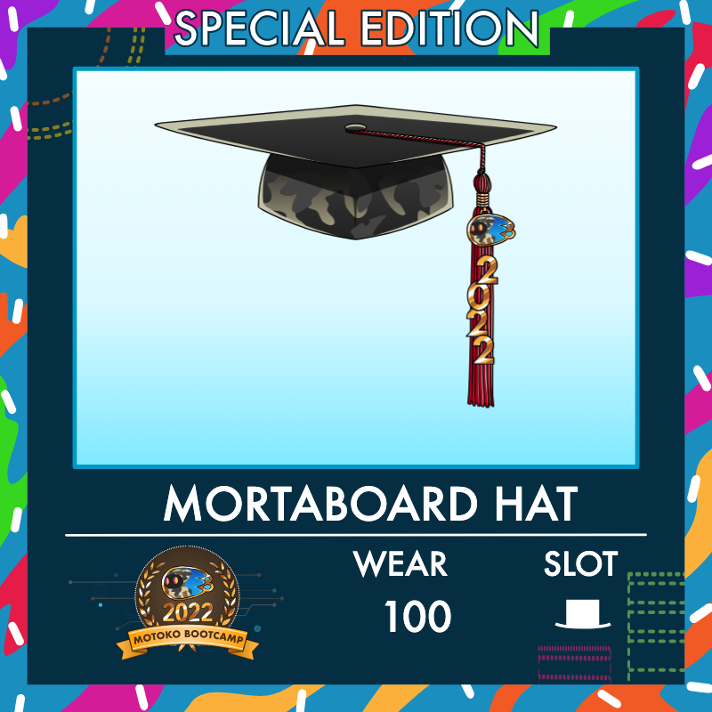

# Day 5️⃣

## 💭 Story

Day 5! You can be proud of yourself. We are at the end of the training.

This is the last day where we will be coding together.  
Over the next two days you will enter the graduation phase of this adventure and you'll start to work on your final project - without any help from us.  

But before jumping we still have some topics to delve into, including:

- What is **Internet Identity** and how to use it?
- Accessing to a canister through a browser with **HTTP requests**.
- Integrating with other blockchains (e.g. **Ethereum** and **Bitcoin**).

Mastering those topics will allow you to build more complex applications on the Internet Computer than was is required for graduation. If you're considering becoming an ICP builder after this camp, then make sure to stay fully attentive today!

## Your tasks ✅

> This is a checklist of the tasks you need to complete today. You can do more if you want, but this is the minimum required to consider Level 5 as completed.

- You have completed the project for this level and submitted it on [motokobootcamp.com](https://motokobootcamp.com/).
- You have checked-in with your team and made sure everyone is on track.
- You follow [Motoko Bootcamp](https://www.instagram.com/motokobootcamp/) on Instagram.

## Lectures 🍿

> Be sure to consult the [Motoko Bootcamp](https://calendar.google.com/calendar/u/0/embed?src=c_1a1c0c95f41c3d5729532726aaa57d96e991c5d3254b0f9e02fdf4d9babf4401@group.calendar.google.com) calendar for the precise schedule of each lecture.

| Title                             | Description                                                                            |
| --------------------------------- | -------------------------------------------------------------------------------------- |
| Identity on the Internet Computer | Discover the different ways user can authenticate to your application and hold assets. |
| Unlock the power of Bitcoin       | Let's talk about how the Internet Computer integrates with other blockchains.          |
| Building the Project 5            | Let's code and build together!                                                         |

## 📚 Resources

This set of resources will help you complete this level and contains useful information for your journey ahead.

| Name                 | Type          | URL                                                                                                       | Description                                                                                           |
| -------------------- | ------------- | --------------------------------------------------------------------------------------------------------- | ----------------------------------------------------------------------------------------------------- |
| HTTP Requests        | Chapter       | [Chapter 13](https://github.com/motoko-bootcamp/dao-adventure-training/blob/main/lessons/chapter-13/CHAPTER-13.MD) | Learn how to make HTTP requests to a canister                                                         |
| Bitcoin Integration  | Documentation | [Click Here](https://internetcomputer.org/bitcoin-integration)                                            | Discover how the Internet Computer is connected with the Bitcoin network and how you can leverage it  |
| Ethereum Integration | Documentation | [Click Here](https://internetcomputer.org/ethereum-integration)                                           | Discover how the Internet Computer is connected with the Ethereum network and how you can leverage it |

## Concepts 🧠

> This is a list of key concepts for our study. Before your day ends, please review this list and ensure you've covered each item. It's crucial to have a clear grasp of these concepts. Consider explaining them to a teammate to assess your understanding.

- Understand how to use the `http_request` query function to support direct HTTP requests to a canister.
- Understand what are the boundary nodes and how they are used to connect the **Internet Computer** with clients.
- Understand what is **threshold-ECDSA** and how it enables the **Internet Computer** to interact with other blockchains.

## Motoko pill  💊

> The first Motoko Bootcamp took place online in 2022. After completing the program, graduates received a unique NFT - a mortarboard hat for their ICP Squad avatar, created especially for the event. The project isn't being updated now, but you can take a look at it [here](https://x3ul6-2aaaa-aaaah-abjda-cai.ic0.app/). We're looking forward to bring back similar features in future Motoko Bootcamps.

    
    

## Meme of the day 🙈

> This meme is brought to you by a fellow Motoko Bootcamp student. If you have a meme you'd like to share, please send it to us on the [memes](https://discord.gg/vwEC5RcKBv) channel - we'll feature the best ones here.

    

