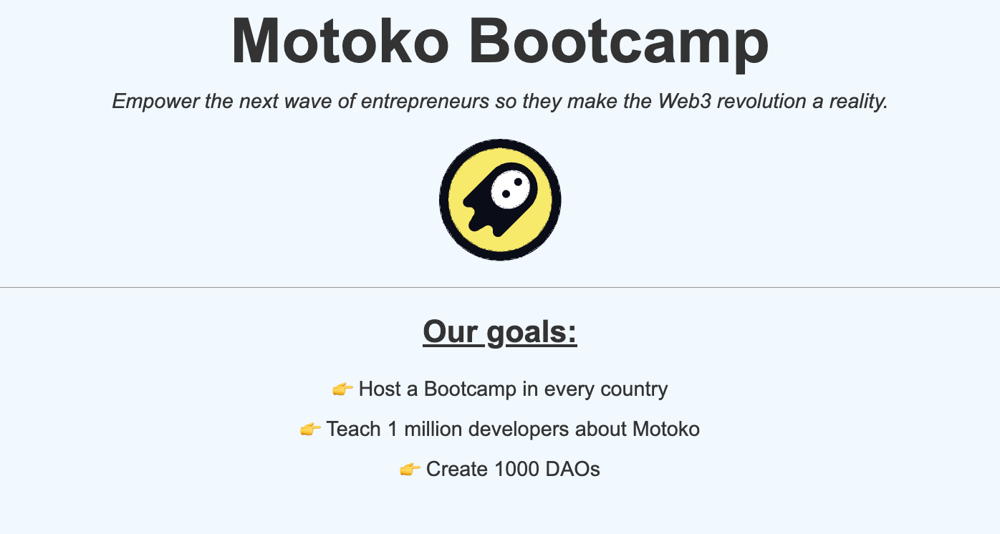

# Project 5 - Showing the DAO to the world


## I💭 Story

It's showtime! 🎤
You have built the foundational structure for the DAO.
By now, it's time to go public and showcase your vision to the rest of the world. The more public and vocal you are about the DAO, the more people will know about it, the more magic will happen.

A simple way to do this is to build a website that will allow anyone to see the name, manifesto, goals and some statistics about your DAO. We will also add a logo to make things cooler 😎

## 🎯 Mission

Canisters are able to serve web content and websites. We will leverage this feature in this level. <br/>

Your mission, is to implement a simple website that will allow anyone to see the name, manifesto, goals of your DAO. We will do that without using any frontend technology. We will simply use Motoko and HTML to generate the webpage.

The end result should look something like this:

<p align="center">  </p>

## 👨‍🏫 Requirements

The website should respect the following requirements:

- The name of the DAO should be displayed.
- The logo of the DAO should be displayed (see below).
- The manifesto of the DAO should be displayed.
- The goals of the DAO should be displayed.

## ✏️ Tasks

1. Select a logo for your DAO. You will need to find a logo that is available as an SVG file. You can use a website like [FlatIcon](https://www.flaticon.com/fr/).

> SVG stands for Scalable Vector Graphics. We will use SVGs because they are basically text files that carry vector information about visuals. This means we don't have to worry about uploading any asset to our canister, we can simply copy the SVG file and paste it directly in our code.

2. Set the value of the immutable variable called `logo` of type `Text` to the value of the logo.

> You can copy the content of the SVG file and paste it directly into your code. Ensure that you use single quotes (`) for any quotes within the SVG file and double quotes (") for enclosing the entire text, as Motoko employs double quotes to delineate strings.

3. Implement the `getStats` function. This function will be used to display some statistics about your DAO.

In Motoko, to serve a webpage, you simply need to implement a http_request query function. This function will be called by the Internet Computer when a user tries to access your webpage.
For instance this is how you would implement a simple http_request function that returns a simple `Hello World` webpage:

```motoko
public query func http_request(request : HttpRequest) : async HttpResponse {
    let response = {
        body = Text.encodeUtf8("Hello world");
        headers = [("Content-Type", "text/html; charset=UTF-8")];
        status_code = 200 : Nat16;
        streaming_strategy = null
    };
    return(response)
}
```

4. Implement the `http_request` query function. This function will be used to serve the webpage of your DAO. You can use the `_getWebpage` function to generate the HTML of the webpage.

## 📺 Interface

At the end of this level, your canister should implement the following interface:

```motoko
actor {
  getStats : shared query () -> async DAOStats;
  http_request : shared query (request : HttpRequest) -> async HttpResponse;
}
```
