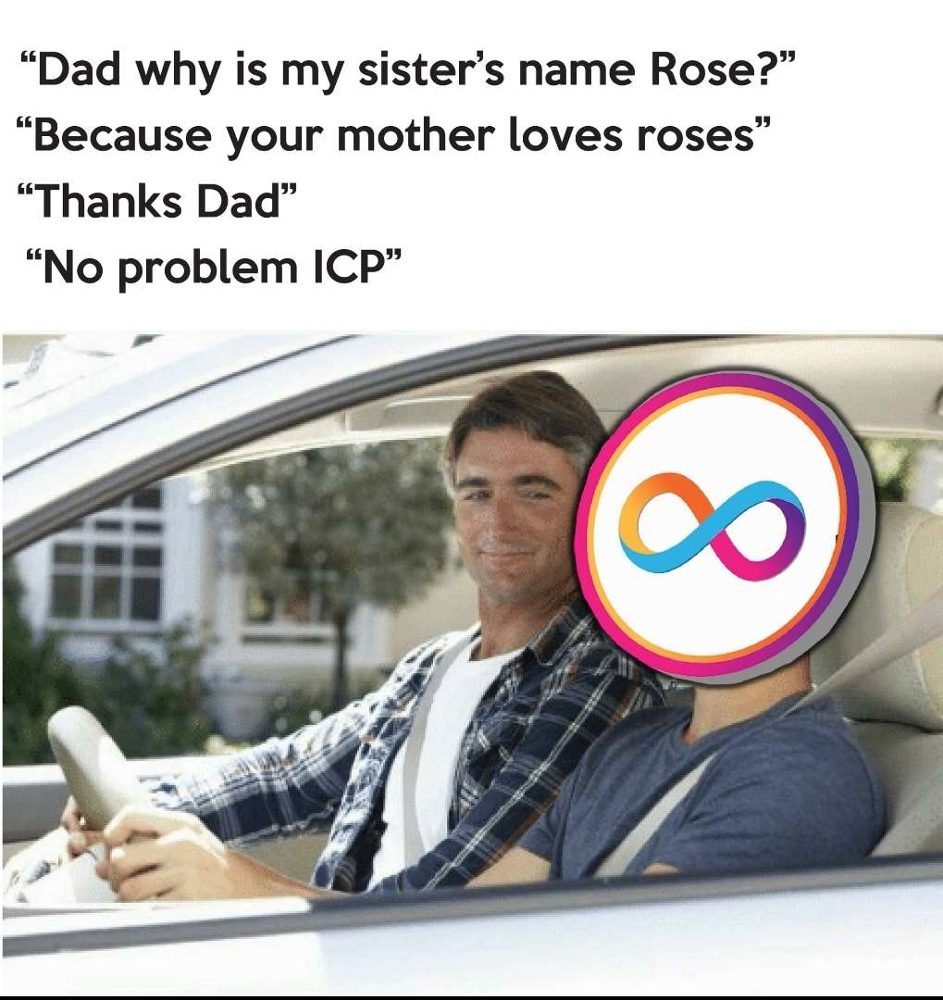

# Day 1️⃣

## Introduction

Welcome to the elite [Motoko Bootcamp](https://twitter.com/motoko_bootcamp), where talented minds like yours gather to learn and master the art of programming on the **Internet Computer**.

Today marks your exciting first day, and while it may be intense, take the chance to bond with your teammates and brace yourself for the adventure ahead.  

Don't worry if you fall behind; allow yourself the time needed to grasp the material. Keep in mind that 7 days is a brief period to learn everything there is to know about **Web 3.0** and the **Internet Computer**. All resources will be available after the week is over, so you can catch-up on anything you've missed.
Above all, the most vital aspect of the Bootcamp is to have fun and build connections - let's learn and all grow together.

## Your tasks ✅

> This is a checklist of the tasks you need to complete today. You can do more if you want, but this is the minimum required to consider Level 1 as completed.

- You have joined a team and met with your teammates.
- You have your environment set up and ready to deploy applications on the Internet Computer.
- You have completed the project for this level and submitted it on [motokobootcamp.com](https://motokobootcamp.com/).

## Lectures 🍿

> Be sure to consult the [Motoko Bootcamp](https://calendar.google.com/calendar/u/0/embed?src=c_1a1c0c95f41c3d5729532726aaa57d96e991c5d3254b0f9e02fdf4d9babf4401@group.calendar.google.com) calendar for the precise schedule of each lecture.

| Title                                                        | Description                                                               |
| ------------------------------------------------------------ | ------------------------------------------------------------------------- |
| Introduction to building with Motoko </a>                    | Discover the Motoko language in 1 hour.                                   |
| Introduction to `dfx`                                        | Discover `dfx` the official SDK for the Internet Computer.                |
| Why and how to build a **DAO** on the **Internet Computer**? | Discover the power of DAOs and how to build one on the Internet Computer. |
| Building the Level 1                                         | Let's code together and build the project for this level.                 |

## Resources 📚

> This set of resources will help you complete this level and contains useful information for your journey ahead.

| Name                        | Type          | URL                                                                                                     | Description                                                            |
| --------------------------- | ------------- | ------------------------------------------------------------------------------------------------------- | ---------------------------------------------------------------------- |
| Fundamental concepts        | Lesson        | [Chapter 1](https://github.com/motoko-bootcamp/dao-adventure/blob/main/lessons/chapter-1/CHAPTER-1.MD)  | Learn about the fundamental concepts of Motoko - a must read!          |
| Common programming concepts | Lesson        | [Chapter 2](https://github.com/motoko-bootcamp/dao-adventure/blob/main/lessons/chapter-2/CHAPTER-2.MD)  | Learn about variables, functions and basic expressions in Motoko.      |
| Primitive Types             | Lesson        | [Chapter 3](https://github.com/motoko-bootcamp/dao-adventure/blob/main/lessons/chapter-3/CHAPTER-3.MD)  | Learn about primitive types in Motoko.                                 |
| Candid                      | Lesson        | [Chapter 4](https://github.com/motoko-bootcamp/dao-adventure/blob/main/lessons/chapter-4/CHAPTER-4.MD)  | Learn about Candid the IDL of the Internet Computer and why it matters |
| Buffer                      | Documentation | [Base Library - Buffer](https://internetcomputer.org/docs/current/motoko/main/base/Buffer)              | The official documentation for the `Buffer` library in Motoko          |
| Unlocking the power of DAOs | Appendix      | [Appendix](https://github.com/motoko-bootcamp/dao-adventure/blob/main/lessons/appendix-1/APPENDIX-1.MD) | Learn about the power of DAOs                                          |

## Concepts 🧠

> This is a list of key concepts for our study. Before your day ends, please review this list and ensure you've covered each item. It's crucial to have a clear grasp of these concepts. Consider explaining them to a teammate to assess your understanding.

- Understand what is a **canister** and how to deploy one on the **Internet Computer**.
- Understand what **cycles** are and how to top-up your **canister**.
- Understand the difference between a **update** and a **query** function.
- Understand the difference between a mutable and immutable variable.
- Understand what is **Candid** and howo to use the **Candid UI** to interact with your canister.
- Being comfortable with the **Motoko** syntax and the basic concepts of programming.
- Being comfortabler deploying, managing and interacting with canisters through `dfx`.
- You understand what is a DAO and how it represents a new paradigm for organizing human activity and creating value.

## Motoko pill of the day 💊

> Before deciding to call it Motoko, the language developed by DFINITY for the Internet Computer was actually called ActorScript. The name was changed to Motoko in 2019 and was inspired by the character Motoko Kusanagi from the anime Ghost in the Shell.

    

## Meme of the day 🙈

> This meme is brought to you by a fellow Motoko Bootcamp student. If you have a meme you'd like to share, please send it to us on the [memes](https://discord.gg/vwEC5RcKBv) channel - we'll feature the best ones here.

    

