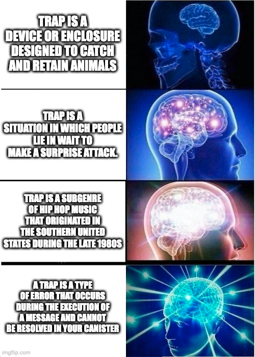

# Day 3️⃣

## Introduction

Welcome back for **Day 3!**  

Welcome to Day 3 of the **Motoko Bootcamp**. As we near the middle of the week, we hope you're all advancing, acquiring new skills, and enjoying the journey.

Today we will talk about two fundamental topics:

- Interacting with other canisters through intercanister calls.
- Handling errors in **Motoko**.

It's vital to master the topics we'll explore today. If you need assistance, don't hesitate to reach out to your teammates or mentors. Remember, we're all here to learn, share a laugh, and support one another. 😉

## Your tasks ✅

> This is a checklist of the tasks you need to complete today. You can do more if you want, but this is the minimum required to consider Level 2 as completed.

- You have checked a [few projects from previous Motoko Bootcamp students](https://github.com/motoko-bootcamp/awesome-students) and have a started to gather ideas for your own final project.
- You have completed the project for this level and submitted it on [motokobootcamp.com](https://motokobootcamp.com/).
- You have checked-in with your teams and make sure everyone is on track.
- You follow [Motoko Bootcamp](https://twitter.com/motoko_bootcamp) on Twitter.

## Lectures 🍿

> Be sure to consult the [Motoko Bootcamp](https://calendar.google.com/calendar/u/0/embed?src=c_1a1c0c95f41c3d5729532726aaa57d96e991c5d3254b0f9e02fdf4d9babf4401@group.calendar.google.com) calendar for the precise schedule of each lecture.

| Title                     | Description                                                  |
| ------------------------- | ------------------------------------------------------------ |
| Intercanisters calls </a> | Discover several types of datastructures in Motoko           |
| Handling erros in Motoko  | Discover how to leverage the code of other Motoko developers |
| Building the Level 3      | Let's code together and build the project for this level.    |

## 📚 Resources

This set of resources will help you complete this level and contains useful information for your journey ahead.

| Name          | Type          | URL                                                                                                       | Description                                                   |
| ------------- | ------------- | --------------------------------------------------------------------------------------------------------- | ------------------------------------------------------------- |
| Handle errors | Lesson        | [Chapter 9](https://github.com/motoko-bootcamp/dao-adventure/blob/main/lessons/chapter-9/CHAPTER-9.MD)    | Discover how to handle errors in Motoko                       |
| Intercanister | Lesson        | [Chapter 11](https://github.com/motoko-bootcamp/dao-adventure/blob/main/lessons/chapter-11/CHAPTER-11.MD) | Learn how to perform intercanister calls in Motoko            |
| Result        | Documentation | [Base Library - Result](https://internetcomputer.org/docs/current/motoko/main/base/Result)                | The official documentation for the `Result` library in Motoko |

## Concepts 🧠

> This is a list of key concepts for our study. Before your day ends, please review this list and ensure you've covered each item. It's crucial to have a clear grasp of these concepts. Consider explaining them to a teammate to assess your understanding.

- Understand that mutable state cannot be shared outside of an actor.
- Understand how to perform intercanister calls in Motoko.
- Understand what is a `Principal` and how it's used on the Internet Computer.
- Getting comfortable with the `Result` type and how to use it.
- Getting comfortable with the concept of `trap` in Motoko and understand the challenges of non atomic functions.

## Motoko pill of the day 💊

> Motoko was created by Andreas Rossberg who also co-created WebAssembly. He is the father of Motoko and a real genius that worked at the DFINITY Foundation in the early days. Here is [his official video](https://www.youtube.com/watch?v=4eSceDOS-Ms) presentation. Thanks Andreas!

    

## Meme of the day 🙈

> This meme is brought to you by a fellow Motoko Bootcamp student. If you have a meme you'd like to share, please send it to us on the [memes](https://discord.gg/vwEC5RcKBv) channel - we'll feature the best ones here.

    

