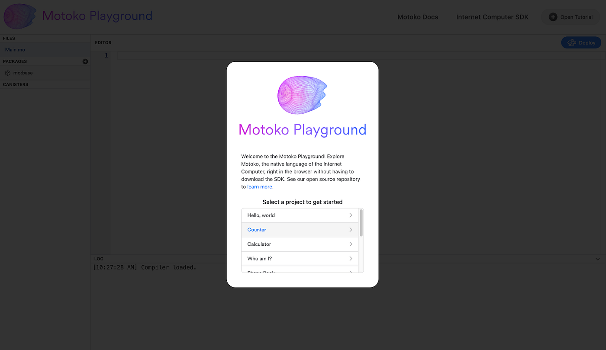

# Day 3️5️⃣

## Introduction

It's Day 5 - Time flies! You should be proud of yourself, as we're nearing the end of the week.

Today, we'll delve into advanced topics, including:

- What is **Internet Identity** and how to use it?
- Integrating with the Web2 world (eg. by doing HTTP request from your canister).
- Integrating with other blockchains (e.g. Ethereum and Bitcoin).

Mastering those topics will allow you to build more complex and interesting applications on the Internet Computer.

## Your tasks ✅

> This is a checklist of the tasks you need to complete today. You can do more if you want, but this is the minimum required to consider Level 2 as completed.

- You have completed the project for this level and submitted it on [motokobootcamp.com](https://motokobootcamp.com/).
- You have checked-in with your team and made sure everyone is on track.
- You follow [Motoko Bootcamp](https://www.instagram.com/motokobootcamp/) on Instagram.

## Lectures 🍿

> Be sure to consult the [Motoko Bootcamp](https://calendar.google.com/calendar/u/0/embed?src=c_1a1c0c95f41c3d5729532726aaa57d96e991c5d3254b0f9e02fdf4d9babf4401@group.calendar.google.com) calendar for the precise schedule of each lecture.

| Title                                  | Description                                                                            |
| -------------------------------------- | -------------------------------------------------------------------------------------- |
| Identity on the Internet Computer </a> | Discover the different ways user can authenticate to your application and hold assets. |
| Unlock the power of Bitcoin            | Let's talk about how the Internet Computer integrates with other blockchains.          |
| Building the Level 5                   | Let's code together and build the project for this level.                              |

## 📚 Resources

This set of resources will help you complete this level and contains useful information for your journey ahead.

[TODO]

## Concepts 🧠

> This is a list of key concepts for our study. Before your day ends, please review this list and ensure you've covered each item. It's crucial to have a clear grasp of these concepts. Consider explaining them to a teammate to assess your understanding.

- Understand the difference between **stable** & **heap** memory.
- Understand how to use the `stable` keyword and what are the `stables `types.
- Getting familiar with upgrading a canister.
- Getting familiar with the common challenges associated with upgrading a canister.
- Understand the basics of frontend development on the Internet Computer and how to use the JavaScript agent.

## Motoko pill of the day 💊

> The Motoko Playground is a great tool to learn and experiment with Motoko. It's a web based IDE that allows you to write, compile and deplopy Motoko programs directly from your browser. You can access it [here](https://m7sm4-2iaaa-aaaab-qabra-cai.raw.ic0.app/).

    

## Meme of the day 🙈

> This meme is brought to you by a fellow Motoko Bootcamp student. If you have a meme you'd like to share, please send it to us on the [memes](https://discord.gg/vwEC5RcKBv) channel - we'll feature the best ones here.

    

