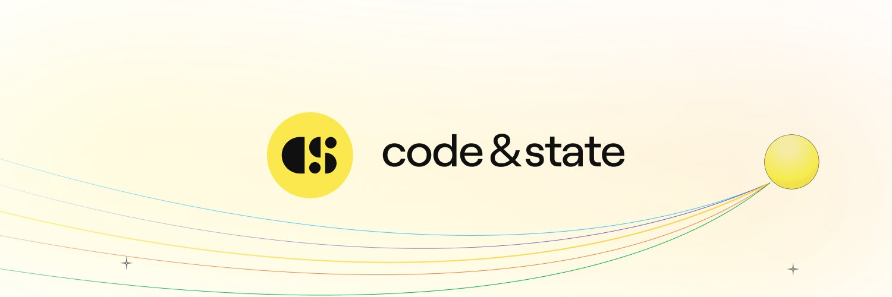

# Level 6 - Keep Buiding!

## Introduction

Congratulation for making it this far 👏
You've finished the foundational DAO-course, but keep in mind that this was only the beginning. The rest of the story belongs to you. Here are some suggestions for what to do next:

## Keep building 👷‍♂️

Whatever happens, keep building! There's only one way forward and that's the correct one.
We have a lot of ressources to help you on your journey. Here are some options:

### Option 1: Keep building the DAO 🏗️

Since you already have the foundation for a DAO. Why not keep building on top of it? Here are some suggestions:

- Add a frontend to the DAO.
- Improve the voting system to allow for more complex voting scenarios and long-term incentives.
- Create a treasury for the DAO and allow members to vote on how to spend the funds.
- Checkout the SNS framework and see how you can leverage it to raise funds and expand the DAO.

Here are some inspirations from previous students:

- [Motoko Bootcamp DAO](https://7xvuv-ziaaa-aaaak-qbvaq-cai.ic0.app/) - A DAO that controls a website and can be used to vote on the displayed content. Integrates with Internet Identity for authentication.
  - [VODAO](https://7fpd5-oyaaa-aaaap-qa5kq-cai.ic0.app/) - A liquid democracy for the Internet Computer. Integrates with [Plug wallet](https://plugwallet.ooo/) for authentication and allow users to stake their tokens into neurons.
  - [Discuss and Vote](https://5razo-nqaaa-aaaal-abw3a-cai.ic0.app/) - Another DAO with a sophisticated voting system and UI. Integrates with [Plug wallet](https://plugwallet.ooo/) for authentication.

### Option 2: Start a new project 🚀

DAOs are not the only thing you can build with Motoko. You can build anything you want. Here are some suggestions:

- Start your own NFT collection.
- Build a decentralized social network.
- Build a decentralized exchange or a decentralized marketplace.
- Build a game.

There are no limits to what you can build. Only your imagination.
Here are some inspirations from previous students:

- [Motoko Art Wall](https://4bzoe-qiaaa-aaaal-qb4ca-cai.icp0.io/) - Draw simple pictures and post them on the Wall in the Internet Computer.
  - [IC Batteries](https://wo25k-iqaaa-aaaan-qacda-cai.ic0.app/) - A fully customizable NFT collection.
- [Meme Wall](https://7bjjl-oaaaa-aaaap-abb2a-cai.icp0.io/) - A meme wall where anyone can post a meme and vote on the best ones.

### Option 3: Join a team and contribute to an existing project 🤝

In the Motoko Bootcamp Discord, we have a section dedicated to builders. This is where you can find projects that are building in the open. Some of them are looking for contributors.

- Take a look the [Builders](https://discord.gg/YVTpqfaFwC) channel on Discord.

## Get involved in the ecosystem 🌱

### Join us for the next ICP Community Conference 🥳

  

The ICP Community Conference is the 1st organized conference that celebrates, inspires, & connects the #ICP ecosystem. The first one took place in May 2023 and gathered 100+ community members. This was an absolute blast and we're planning the next one for 2024!

- Checkout the recap video of the [first conference](https://www.youtube.com/watch?v=CG2wFpUTnxk).
- Follow ICP Community Conference on [Twitter](https://twitter.com/icp_cc) to stay updated - @icp_cc.
- Join the [Email List](https://webforms.pipedrive.com/f/6N8jTemXLwtr7dhqUokx3X1BIwMQFD6jpror1KBZNhTOOaly1bFhWhASOYXRT9QotZ) to get notified about the next conference and access early bird tickets.

### Find a job with TalentDB 💼

  

Are you looking for a job in Web3? Make sure to check out TalentDB - a recruiting agency for the Internet Computer.

- Follow TalentDB on [Twitter](https://twitter.com/TalentDB_ICP) to stay updated with new opportunities - @TalentDB_ICP.
- Fill out this form to join the [Talent Pool](https://airtable.com/shrwzsX9FhZ5X0wlv). This will allow you to be matched with the right opportunities.
- Connect with Ben in [our Talent-Room](https://discord.gg/vyyJ8A7p3G) on Discord.

### Apply for a grant with the DFINITY Foundation 💰

  

DFINITY operates a [developer grant program](https://dfinity.org/grants) to support those building on the Internet Computer platform. If you have an idea and want to develop on the IC, you can request funding, which can range from $5,000 to $100,000 (though first-time applicants are unlikely to receive $100,000). The grant program focuses on the following areas:

- Canister Development Kits (CDKs) & Agents.
- Developer Tooling (such as IDEs, debuggers, and logging libraries).
- Infrastructure (including oracles and asset bridges).
- Integrations & APIs (e.g., chat, email, maps).
- Apps & Open Internet Services.

Additionally, DFINITY has announced a specific $5 million program to support the intersection of AI and blockchain technology, as detailed [here](https://www.prnewswire.com/news-releases/dfinity-foundation-launches-5-million-grant-to-support-decentralized-ai-on-the-internet-computer-blockchain-301877065.html).

DFINITY also offers a grant program for [educational and community initiatives](https://dfinity.org/community-grants). If you have an idea for a hackathon, workshop, or other community event, you can apply for a grant to secure funding.

Note: Please make sure to mention that you were referred by the Motoko Bootcamp when applying for a grant. Additionally, we are available to assist you with your grant application.

### Get involved and help us write the next chapter of Motoko Bootcamp 🏕️

    
    
    

You can help us grow the Bootcamp by:

- Creating a pull request to add a new level to the Bootcamp, improve existing levels, translate the content in another language (Spanish, Chinese, French) or add a new programming language (Rust, TypeScript, Python...)
- Join us as an [angel](), [speaker](https://discord.gg/qcZvW2k5) or [builder](https://discord.gg/YVTpqfaFwC).
- Invite your friends or colleagues to the next Bootcamp.
- Give us your feedback on the Bootcamp, ideas on how we can improve it and what you would like to see next in the [feedback channel](https://discord.gg/vTcwUdUwTf).
- Share your experience on social media and tag us on [Twitter](https://twitter.com/motoko_bootcamp) - @motoko_bootcamp.
- Help us organize events, what about hosting the next Bootcamp in your hometown?

### Become an Entrepreneur In Residence at Code & State ⭐️

  

Finally, if you're really passionate about the Internet Computer and want to work full-time on it, you can apply to become an **Entrepreneur In Residence** at [Code & State](https://www.codeandstate.com/).
We are looking for talented individuals who want to make it easier for developers to build and earn on the Internet Computer. This means building tools, frameworks, libraries, templates, and anything else that will help developers.

#### Which projets are we interested on? 🙋‍♂️

- Tools, frameworks, libraries, templates, and anything else that will help developers build on the Internet Computer.
- Education initiatives that will help developers learn how to build on the Internet Computer (like the Motoko Bootcamp).
- Projects that will help developers earn on the Internet Computer: DeFi, stablecoins, NFTs, DAOs, ...
- Opportunity worth 100M+ - we target ventures that have the potential to grow to a valuation of at least $100m because this means it is chasing a big enough market opportunity to put our support and expertise to good use.

#### Which projects are we not interested on? 🙅‍♂️

We’re focused on ventures that make it easier to build & earn on ICP. While we respect the value that NFT collections, meme coins, games, & gambling projects have for the ecosystem, they are out of scope for our acceleration program

##### What do we offer? 🤝

- Funding for 1-2 years for you and your team.
- Legal entity support.
- Strategic support and guidance.
- Talent and recruiting support.
- Marketing and PR support.
- Design and UI/UX support.
- Code auditing and technical support.
- Access to the Code & State network.

#### How to learn more & apply? 📝

Check out the acceleration program [here](https://www.codeandstate.com/accelerator) and apply [here](https://www.codeandstate.com/apply).

## Ressources 📚

Here are a few selected ressources to help you in your journey:

- []
- []
- []
- []
- []
- []
